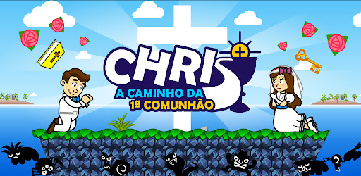

<h2>Olá!👋</h2> 

Sou Fernando, designer gráfico e desenvolvedor web front-end e back-end (PHP MySQL, JavaScript, JQuere, CSS e HTML), desenvolvo também jogos e animações em 2D (ActionScript 3.0 / Adobe Animate), Estou cursando Tecnologia em Análise e Desenvolvimento de Sistemas, estou buscando me atualizar na área de tecnologia.  Estou também no Linkedin: <a href="https://www.linkedin.com/in/fernando-quaresma-10016960" target="_blank" >LINK DO MEU PERFIL</a> 

<h2>Conheça o meu novo projeto: Chris a Caminho da 1ª Comunhão</h2>
 
um jogo católico voltado para o público infantil no estilo plataforma 2D para aprender o catecismo da Igreja Católica de modo divertido. 
<a href="https://play.google.com/store/apps/details?id=air.Christeste311012024" target="_blank" >LINK DO GAME NA GOOGLE PLAY STORE</a> 

 Muito obrigado por sua atenção! 😊👍

<!--
**fernandoquaresmacampos/fernandoquaresmacampos** is a ✨ _special_ ✨ repository because its `README.md` (this file) appears on your GitHub profile.
